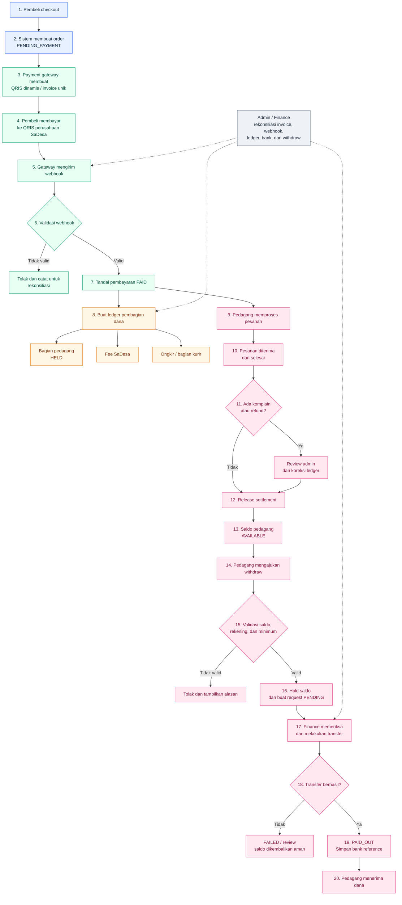

# Diagram Ringkas Pembayaran QRIS Perusahaan sampai Withdraw

```mermaid
flowchart TD
    A[1. Pembeli checkout] --> B[2. Sistem membuat order\nPENDING_PAYMENT]
    B --> C[3. Payment gateway membuat\nQRIS dinamis / invoice unik]
    C --> D[4. Pembeli membayar\nke QRIS perusahaan SaDesa]
    D --> E[5. Gateway mengirim webhook]
    E --> F{6. Validasi webhook}
    F -->|Tidak valid| G[Tolak dan catat untuk\nrekonsiliasi]
    F -->|Valid| H[7. Tandai pembayaran PAID]

    H --> I[8. Buat ledger pembagian dana]
    I --> I1[Bagian pedagang\nHELD]
    I --> I2[Fee SaDesa]
    I --> I3[Ongkir / bagian kurir]

    H --> J[9. Pedagang memproses pesanan]
    J --> K[10. Pesanan diterima\ndan selesai]
    K --> L{11. Ada komplain\natau refund?}
    L -->|Ya| M[Review admin\ndan koreksi ledger]
    L -->|Tidak| N[12. Release settlement]
    M --> N

    N --> O[13. Saldo pedagang\nAVAILABLE]
    O --> P[14. Pedagang mengajukan withdraw]
    P --> Q{15. Validasi saldo,\nrekening, dan minimum}
    Q -->|Tidak valid| R[Tolak dan tampilkan alasan]
    Q -->|Valid| S[16. Hold saldo\ndan buat request PENDING]
    S --> T[17. Finance memeriksa\ndan melakukan transfer]
    T --> U{18. Transfer berhasil?}
    U -->|Tidak| V[FAILED / review\nsaldo dikembalikan aman]
    U -->|Ya| W[19. PAID_OUT\nSimpan bank reference]
    W --> X[20. Pedagang menerima dana]

    Y[Admin / Finance\nrekonsiliasi invoice, webhook,\nledger, bank, dan withdraw] -.-> E
    Y -.-> I
    Y -.-> T

    classDef buyer fill:#E8F1FF,stroke:#2563EB,color:#102A43
    classDef payment fill:#E8FFF3,stroke:#059669,color:#064E3B
    classDef ledger fill:#FFF7E6,stroke:#D97706,color:#78350F
    classDef settlement fill:#FFE8EF,stroke:#DB2777,color:#831843
    classDef review fill:#EEF2F7,stroke:#475569,color:#1E293B

    class A,B buyer
    class C,D,E,F,G,H payment
    class I,I1,I2,I3 ledger
    class J,K,L,M,N,O,P,Q,R,S,T,U,V,W,X settlement
    class Y review
```
